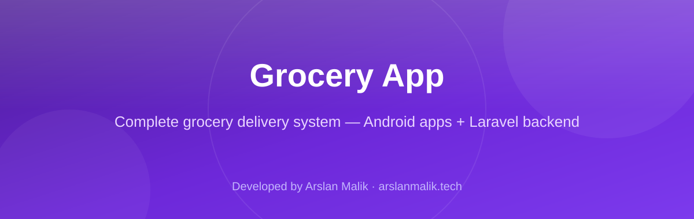
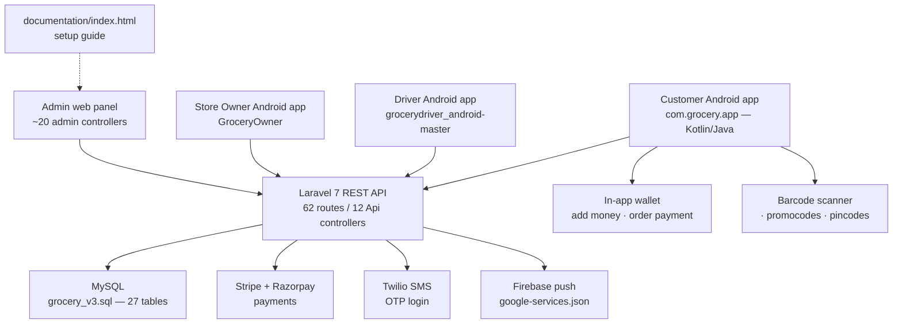

<p align="center">
  
</p>

<p align="center">
  
  
  
  
  
  
</p>

> **Developed by [Arslan Malik](https://github.com/arsalanmaalik461)**
> 📱 WhatsApp: [+92 300 8987448](https://wa.me/923008987448) · 🌐 Website: [arslanmalik.tech](https://arslanmalik.tech)

---

## 🌟 Executive Overview

**Grocery App** is a complete grocery delivery platform: three native Android applications (customer, delivery driver, and store owner) backed by a **Laravel 7** admin panel and REST API on **MySQL**. It covers the full order lifecycle — browsing items and categories, cart and checkout with promocodes, pincode-based delivery-zone checks, timeslot selection, payments, wallet, order tracking, and driver-side delivery management — with the store owner controlling everything from the admin dashboard.

The backend (`admin/`) ships with **62 API routes** across 12 API controllers, around 20 admin-panel controllers (orders, items, categories, drivers, banners, sliders, promocodes, pincodes, timeslots, payments, notifications, reports), 28 Eloquent models, and integrations for **Stripe** and **Razorpay** payments, **Twilio** OTP SMS, social login, and role/permission management. The customer Android app (`Android/GroceryAppCode`, package `com.grocery.app`) is written in **Kotlin + Java** (82 Kotlin files, 6 Java files; minSdk 21, targetSdk 30) and even ships a signed release bundle (`app-release.aab`). The SQL schema (`database/grocery_v3.sql`) defines 27 tables, and `documentation/index.html` walks through the whole setup.

## 📑 Table of Contents

- [✨ Key Features & Highlights](#-key-features--highlights)
- [🖥️ Feature Showcase](#️-feature-showcase)
- [🏗️ System Architecture](#️-system-architecture)
- [🚀 Quickstart & Installation Guide](#-quickstart--installation-guide)
- [📂 Project Structure](#-project-structure)
- [🛡️ Security & Notes](#️-security--notes)

---

## ✨ Key Features & Highlights

| Feature | Description |
| :--- | :--- |
| 🛒 Customer Android app | Kotlin/Java shopping app — home, search, categories, item detail, cart, checkout, wallet, order history, barcode scanning |
| 🚴 Delivery driver app | Separate Android project (`grocerydriver_android-master`) with Firebase (`google-services.json`) for driver-side deliveries |
| 🏪 Store owner app | `GroceryOwner` Android project so the store can manage the business on the go |
| 🖥️ Laravel admin panel | ~20 admin controllers — orders, items, categories, drivers, banners, sliders, promocodes, pincodes, timeslots, payments, notifications, reports |
| 🔌 REST API (62 routes) | 12 API controllers (`Address`, `Cart`, `Checkout`, `Item`, `Category`, `Driver`, `Pincode`, `Ratting`, `Time`, `User`, `Banner`, `Admin`) |
| 💳 Payments | Stripe + Razorpay integrations (`stripe/stripe-php`, `razorpay/razorpay`) with `Payment` / `Transaction` models |
| 📲 OTP login | Twilio-powered SMS OTP verification (`OTPVerificatinActivity` in the app) |
| 🎟️ Promocodes & delivery zones | `PromocodeController` + `PincodeController` — coupon codes and pincode-based delivery eligibility checks |
| 🕐 Delivery timeslots | `TimeController` manages bookable delivery time windows |
| 👛 Wallet | In-app wallet with add-money flow (`MyWalletActivity`, `AddMoneyActivity`) |
| 🗄️ MySQL schema | `database/grocery_v3.sql` — 27 tables covering users, orders, items, variations, ingredients, transactions |
| 📖 Full documentation | `documentation/index.html` — the original setup guide for the whole system |
| 📦 Release build included | Signed `app-release.aab` for the customer app ships in the repo |

---

## 🖥️ Feature Showcase

### 1. 🛒 Customer Shopping App (Kotlin/Java)

> "Browse, scan, cart, pay — the whole grocery run in one app."

- **Activities:** `DashboardActivity`, `CartActivity`, `ItemDetailActivity`, `OrderPaymentActivity`, `OrderSelectAddressActivity`, `GetAddressActivity`, `ActivityNewAddress`, `MyWalletActivity`, `AddMoneyActivity`, `OrderDetailActivity`, login / OTP / password flows
- **Fragments:** `HomeFragment`, `SearchFragment`, `FavouriteFragment`, `HistoryFragment`, `SettingFragment` — bottom-navigation-style storefront
- `BarcodeScanningActivity` lets shoppers scan products straight into the cart
- Wallet with add-money and item favorites (`Favorite` model) round out the shopping experience

### 2. 🖥️ Laravel Admin Panel + REST API

> "One dashboard runs the store; one API feeds all three apps."

- **Admin controllers:** orders, items, categories, users, drivers, banners, sliders, promocodes, pincodes, timeslots, payments, notifications, reports, and static pages (about / contact / privacy / terms)
- **62 API routes** (`admin/routes/api.php`) serve the Android apps — cart, checkout, promocodes, pincode checks, ratings, timeslots, driver endpoints
- **28 Eloquent models:** `Order`, `OrderDetails`, `Cart`, `Item`, `ItemImages`, `Variation`, `Ingredients`, `Category`, `Banner`, `Slider`, `Promocode`, `Pincode`, `Time`, `Transaction`, `Payment`, `Ratting`, `Notification`, …
- Roles and permissions via `spatie/laravel-permission`, social login via `laravel/socialite`

### 3. 💳 Payments, OTP & Wallet

> "Pay how you want, log in with a tap of a code."

- Stripe and Razorpay payment integrations in the backend; order payment handled in `OrderPaymentActivity`
- Twilio SMS OTP for phone-based login (`OTPVerificatinActivity`, `ForgetPasswordActivity`, `ChangePasswordActivity`)
- In-app wallet with add-money flow and transaction records (`Transaction` model)
- Promocode application at checkout (`promocodelist` / `promocode` endpoints)

### 4. 🕐 Zones, Timeslots & the Driver Loop

> "Deliveries only where they should be, when the customer chose."

- Pincode-based delivery-zone management — the checkout verifies serviceability before the order goes through
- Configurable delivery time windows via `TimeController`
- Item ratings (`RattingController`) and order history for customers
- Dedicated driver and owner Android projects complete the triangle: customer orders, driver delivers, owner oversees

---

## 🏗️ System Architecture



**Flow:** All three Android apps talk to the same Laravel 7 API. The API layer handles auth (OTP/social), cart, checkout, promocodes, pincode-zone checks, timeslot booking, and payments, persisting everything to MySQL. The admin web panel manages catalog, orders, drivers, banners, promocodes, and reports.

---

## 🚀 Quickstart & Installation Guide

### Prerequisites

- **Backend:** PHP 7.2.5+, Composer, MySQL, Node.js (Laravel Mix 5 for the admin UI)
- **Android:** Android Studio (Arctic Fox or compatible with AGP 4.0.1), Android SDK 30

### Backend (Laravel Admin Panel + API)

```bash
# 1. Enter the backend directory
cd admin

# 2. Install PHP dependencies
composer install

# 3. Configure the environment
cp .env.example .env
php artisan key:generate
# Edit .env: set DB_DATABASE, DB_USERNAME, DB_PASSWORD

# 4. Import the database schema (27 tables)
mysql -u root -p your_database < ../database/grocery_v3.sql

# 5. Build the admin UI assets
npm install
npm run dev        # or: npm run production

# 6. Serve the backend
php artisan serve
```

The API will be available at `http://localhost:8000/api/...` — the Android apps must point their base URL at this host.

### Customer Android App

```bash
# 1. Open Android/GroceryAppCode in Android Studio
# 2. Let Gradle sync (AGP 4.0.1, Kotlin 1.4.32, compileSdk 30)
# 3. Update the API base URL in the app's api package to your server
# 4. Run on a device/emulator (minSdk 21)
```

A signed release bundle is already included at `Android/Grocery_User.zip → GroceryAppCode/app/release/app-release.aab`.

### Driver & Owner Apps

- **Driver app:** source project is bundled as `Android/Grocery_Driver.zip` (`grocerydriver_android-master/`). Extract it, open in Android Studio, add your own `google-services.json`, and update the API base URL.
- **Owner app:** bundled as `Android/GroceryAppCode/GroceryOwner_06_05_2021.zip` (`GroceryOwner/`). Same steps.

> The full step-by-step guide from the original authors is included as `documentation/index.html` — open it in a browser for screenshots and detailed walkthroughs.

---

## 📂 Project Structure

```
grocery-app/
├── Android/
│   ├── GroceryAppCode/                 # Customer app (Kotlin/Java, com.grocery.app)
│   │   ├── app/src/main/java/com/grocery/app/
│   │   │   ├── activity/               # Cart, checkout, wallet, OTP, orders (82 .kt)
│   │   │   ├── fragment/               # Home, search, history, favourite, settings
│   │   │   ├── api/ model/ adaptor/ utils/ service/ base/ custom/ analyzer/
│   │   └── GroceryOwner_06_05_2021.zip # Store owner Android app
│   ├── Grocery_User.zip                # Customer app + signed app-release.aab
│   └── Grocery_Driver.zip              # Delivery driver Android app
├── Grocery_Android.zip                 # Bundle of the Android apps
├── admin/                              # Laravel 7 backend + admin panel
│   ├── app/
│   │   ├── Http/Controllers/
│   │   │   ├── Api/                    # 12 API controllers (62 routes)
│   │   │   ├── admin/                  # ~20 admin-panel controllers
│   │   │   └── Auth/                   # Social login (Socialite)
│   │   └── *.php                       # 28 Eloquent models
│   ├── routes/api.php / web.php
│   ├── database/                       # Migrations & seeders
│   └── composer.json                   # Stripe, Razorpay, Twilio, Spatie, Socialite
├── database/
│   └── grocery_v3.sql                  # MySQL schema — 27 tables
├── documentation/
│   └── index.html                      # Original full setup documentation
├── docs/assets/banner.svg              # Project banner
└── README.md
```

---

## 🛡️ Security & Notes

- **Credentials are not in the repo by default** — the backend reads them from `admin/.env` (created from `.env.example`); never commit a real `.env`. Set real keys for Stripe, Razorpay, Twilio, Firebase, and the database.
- The Android projects include sample `google-services.json` files — replace them with your own Firebase project's file before building releases.
- The `database/grocery_v3.sql` schema is a starting point; run it on a fresh database and verify table collation/charset matches your MySQL setup.
- This codebase targets older, stable dependency versions (Laravel 7, AGP 4.0.1, Kotlin 1.4.32, compileSdk 30) — plan dependency upgrades deliberately and test the API contract between apps and backend before changing either side.
- The signed `app-release.aab` in the repo is a demo build — always produce your own signed release with your own keystore.

---

<p align="center">
  <sub>Developed with ❤️ by <a href="https://github.com/arsalanmaalik461">Arslan Malik</a> · 📱 <a href="https://wa.me/923008987448">WhatsApp: +92 300 8987448</a> · 🌐 <a href="https://arslanmalik.tech">arslanmalik.tech</a></sub>
</p>
